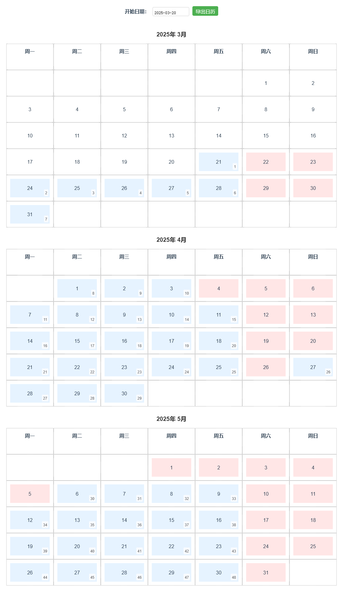

# 工作日计数日历

Demo Site: [shiny-marzipan-79afae.netlify.app](https://shiny-marzipan-79afae.netlify.app)

## 项目简介

一个基于 Vue 3 和 Vite 的日历组件，用于显示工作日计数。

## 项目截图

## 依赖

- [workday-cn](https://github.com/honxinn/workday-cn)

Power by Cursor AI